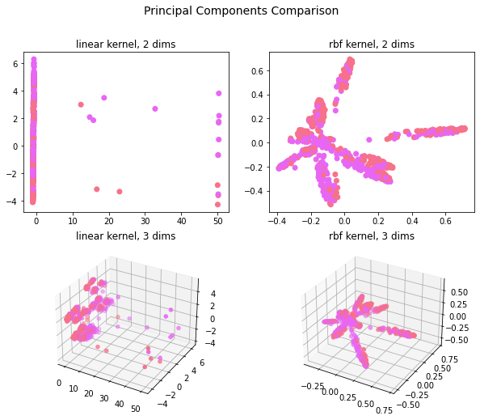
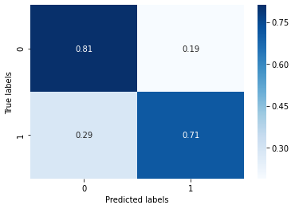
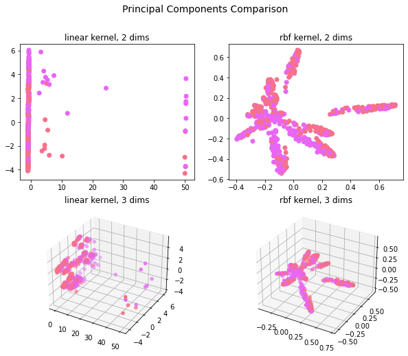
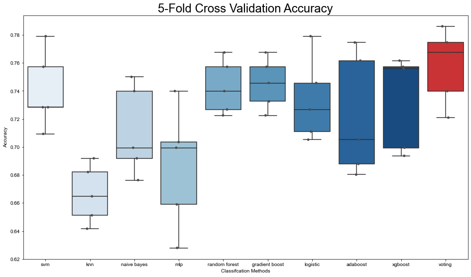

# covid-data-challenge

[TOC]

## Task 1: Clinical data imputation

### Method

We use KNN-3/KNN-6/KNN-9 and SoftImpute with [fancyimpute](https://pypi.org/project/fancyimpute/), and a voting method to choose the best imputation method. The results are organized in folder below.

```shell
csv
├─feature_importance
├─filled_testSet
├─filled_trainSet
└─prediction_testSet
```

For a imputation method [method] in [filled_knn_3/filled_knn_6/filled_knn_9/filled_softimpute/] :

- ./csv/filled_testSet/[method]_testSet.txt
  - Filled **NaN** data using [method] based on **concatenation** of trainSet.txt & testSet.txt.
  - There are columns filled with **NaN** so we need **concatenation** of trainSet.txt & testSet.txt, otherwise nothing meaningful imputation can be obtained.
- ./csv/filled_trainSet/[method]_trainSet.txt
  - Filled **NaN** data using [method] based on trainSet.txt. (or the **concatenation** if needed (Question 1))
- ./csv/feature_importance/[method].csv
  - **Feature importance** of an ensemble methods consist of **random forest**, **gradient boost**, **adaboost** and **xgboost** predicting the **severity** with **filled training dataset** with **5-fold cross-validation**.
- ./csv/prediction_testSet/[method]_pred.txt
  - Prediction of a **voting** method using [method] filled testSet.txt with only clinical data.

### Clinical data prediction

We verify the imputation by predicting the **severity** with **filled** training clinical data only with **5-fold cross-validation**.

#### KNN-3 imputation

**5-fold cross validation summary**

|        | roc        | acc    | recall | sensitivity | specificity |
| ------ | ---------- | ------ | ------ | ----------- | ----------- |
| voting | **0.8274** | 0.7578 | 0.6941 | 0.6941      | 0.8196      |

**t-SNE**



**ROC curve**


ROC AUC score of voting methods: **0.8178458232608112**

**Accuracy@0.5**


**Confusion matrix@0.5**


#### KNN-6 imputation

**5-fold cross validation summary**

|        | roc        | acc    | recall | sensitivity | specificity |
| ------ | ---------- | ------ | ------ | ----------- | ----------- |
| voting | **0.8302** | 0.7625 | 0.7129 | 0.7129      | 0.8105      |

**t-SNE**


**ROC curve**


ROC AUC score of voting methods: **0.8302**

**Accuracy@0.5**


**Confusion matrix@0.5**




#### KNN-9 imputation

**5-fold cross validation summary**

|        | roc        | acc    | recall | sensitivity | specificity |
| ------ | ---------- | ------ | ------ | ----------- | ----------- |
| voting | **0.8350** | 0.7578 | 0.7012 | 0.7012      | 0.8128      |

**t-SNE**



**ROC curve**


ROC AUC score of voting methods: **0.8350**

**Accuracy@0.5**



**Confusion matrix@0.5**


#### Soft imputation

**5-fold cross validation summary**

|        | roc        | acc    | recall | sensitivity | specificity |
| ------ | ---------- | ------ | ------ | ----------- | ----------- |
| voting | **0.8327** | 0.7497 | 0.7294 | 0.7294      | 0.7694      |

**t-SNE**


**ROC curve**


ROC AUC score of voting methods: **0.8327**

**Accuracy@0.5**


**Confusion matrix@0.5**


